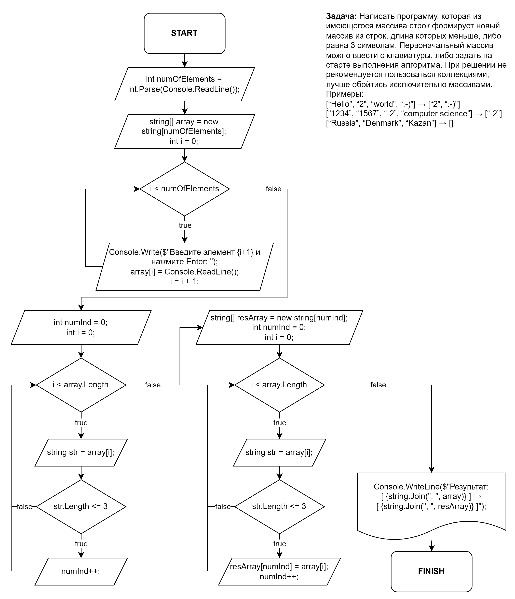
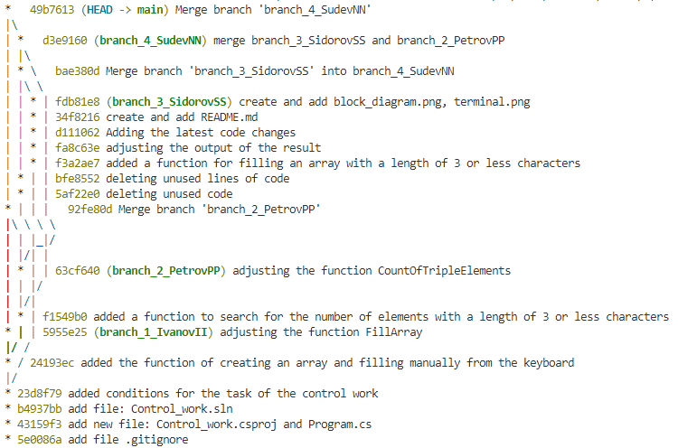

## Итоговая контрольная работа по основному блоку
### Урок 1. Контрольная работа

Задача алгоритмически не самая сложная, однако для полноценного выполнения проверочной работы необходимо:

1. Создать репозиторий на __GitHub__
2. Нарисовать __блок-схему алгоритма__ *(можно обойтись блок-схемой основной содержательной части, если вы выделяете её в отдельный метод)*
3. Снабдить репозиторий __оформленным текстовым описанием__ решения *(файл README.md)*
4. Написать программу, решающую поставленную задачу
5. __Использовать контроль__ версий в работе над этим небольшим проектом *(не должно быть так, что всё залито одним коммитом, __как минимум этапы 2, 3, и 4__ должны быть расположены в разных коммитах)*

__Задача:__ Написать программу, которая из имеющегося массива строк формирует новый массив из строк, длина которых меньше, либо равна 3 символам. Первоначальный массив можно ввести с клавиатуры, либо задать на старте выполнения алгоритма. При решении не рекомендуется пользоваться коллекциями, лучше обойтись исключительно массивами.

**Примеры:**
```
[“Hello”, “2”, “world”, “:-)”] → [“2”, “:-)”]
[“1234”, “1567”, “-2”, “computer science”] → [“-2”]
[“Russia”, “Denmark”, “Kazan”] → []
```
### Решение:

#### 1. Репозиторий создан на [GitHub](https://github.com/SudevNN/Control_Work_1 "Ссылка на GitHub")

#### 2. Блок-схема алгоритма:
> 

3. Репозиторий оформлен текстовым описанием, которое вы сейчас читаете (фаил `README.md`)

4. программа, решающая поставленную выше задачу:
```
string[] FillArray(int num)
{
    string[] array = new string[num];
    for (int i = 0; i < num; i++)
    {
        Console.Write($"Введите элемент {i+1} и нажмите Enter: ");
        array[i] = Console.ReadLine(); 
    }
    return array;
}

// Поиск количества элементов массива, длинной 3 и менее символа
int CountOfTripleElements(string[] arr)
{
    int numInd = 0;
    for (int i = 0; i < arr.Length; i++)
    {
        string str = arr[i];

        if (str.Length <= 3)
        {
            numInd++;
        } 
    }
    return numInd;
}

// Формирует из созданного вручную массива, новый массив из строк, длина которых меньше или равна 3 символам. 
string[] FillArrayToThreeElements(string[] arr, int num)
{
    string[] resArray = new string[num];
    int numInd = 0;
    for (int i = 0; i < arr.Length; i++)
    {
        string str = arr[i];
        if (str.Length <= 3)
        {
            resArray[numInd] = arr[i];
            numInd++;
        }
    }
    return resArray;
}

// Меняем кодировку:
Console.InputEncoding = System.Text.Encoding.GetEncoding("utf-16");

// Уточняем размер массива, для ручного ввода элементов:
Console.Write("Введите количество элементов массива: ");
int numOfElements = int.Parse(Console.ReadLine());

// Заполняем массив вручную элементами
string[] filledArr = FillArray(numOfElements);

// Поиск количества элементов массива, длинной 3 и менее символа
int numberOfTripleElements = CountOfTripleElements(filledArr);

// Формирует из созданного вручную массива, новый массив из строк, длина которых меньше или равна 3 символам. 
string[] ArrThreeElements = FillArrayToThreeElements(filledArr, numberOfTripleElements);

// Вывод результата
Console.WriteLine($"Результат: [ {string.Join(", ", filledArr)} ] → [ {string.Join(", ", ArrThreeElements)} ]");
```

Результат вывода в терминал:
> 

5. Подтверждение использования контроля версий:

> 